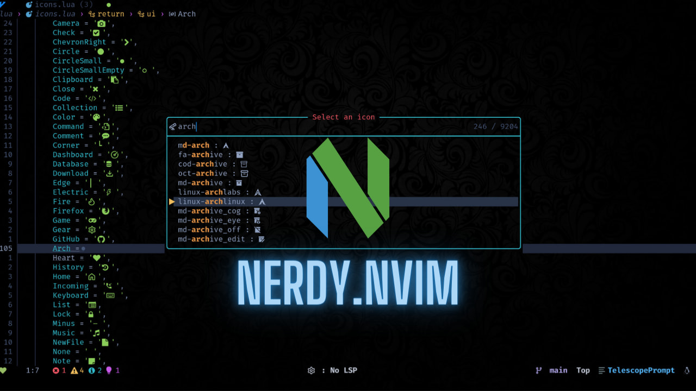

<div align = "center">

<h1><a href="https://github.com/2kabhishek/nerdy.nvim">nerdy.nvim</a></h1>

<a href="https://github.com/2KAbhishek/nerdy.nvim/blob/main/LICENSE">
 </a>

<a href="https://github.com/2KAbhishek/nerdy.nvim/graphs/contributors">
 </a>

<a href="https://github.com/2KAbhishek/nerdy.nvim/stargazers">
</a>

<a href="https://github.com/2KAbhishek/nerdy.nvim/network/members">
 </a>

<a href="https://github.com/2KAbhishek/nerdy.nvim/watchers">
 </a>

<a href="https://github.com/2KAbhishek/nerdy.nvim/pulse">
 </a>

<h3>Find Nerd Glyphs Easily 🤓🔭</h3>

<figure>
  
  <br/>
  <figcaption>nerdy.nvim in action</figcaption>
</figure>

</div>

Do you like [Nerd fonts](https://github.com/ryanoasis/nerd-fonts)? but don't like going over to [their site](https://www.nerdfonts.com/cheat-sheet) to fetch a glyph for your pretty terminal?
Well, me too!

Introducing nerdy.nvim, a super handy plugin that lets you search, preview and insert all nerd font glyphs straight from neovim!

## ✨ Features

- Fuzzy search nerd glyphs, by name and unicode
- Preview glyphs before inserting
- Super lightweight
- Can auto generate new icons from source
- Get nerd glyph by name programmatically

## Setup

### ⚡ Requirements

- You have installed the latest version of `neovim`
- [snacks.nvim picker](https://github.com/folke/snacks.nvim/blob/main/docs/picker.md) — for prettier select UI

### 🚀 Installation

```lua
-- Lazy
{
    '2kabhishek/nerdy.nvim',
    dependencies = {
        'folke/snacks.nvim',
    },
    cmd = 'Nerdy',
},

-- Packer
use '2kabhishek/nerdy.nvim'

```

### 💻 Usage

`nerdy.nvim` adds these commands:

- `Nerdy` - Browse all nerd font icons
- `NerdyRecents` - Browse recently used icons

You can add your custom bindings for the commands:
```lua
vim.keymap.set('n', '<leader>fn', ':Nerdy<CR>', { desc = 'Browse nerd icons' })
vim.keymap.set('n', '<leader>fr', ':NerdyRecents<CR>', { desc = 'Browse recent nerd icons' })
```

check `:help nerdy` for more details.

> NOTE: By default there are no configured keybindings.

#### 🔭 Telescope Extension

Nerdy also comes with a Telescope extension, to use it add the following to your telescope configs.

```lua
require('telescope').load_extension('nerdy')
```

And then call

```viml
:Telescope nerdy
:Telescope nerdy_recent
" or
:lua require('telescope').extensions.nerdy.nerdy()
:lua require('telescope').extensions.nerdy.nerdy_recent()
```

#### 📚 Recent Icons

Nerdy automatically tracks your recently used icons for quick access:

- Recent icons are stored persistently across Neovim sessions
- Access recent icons with `:NerdyRecents` command or `:Telescope nerdy_recent`
- Recent icons appear in order of most recent usage
- Configure maximum number of recent icons to remember

#### ⚙️ Configuration

You can configure nerdy.nvim by calling the setup function:

```lua
require('nerdy').setup({
    max_recent = 20,  -- Maximum number of recent icons (default: 30)
})
```

#### 🔄 Fetch New Icons

Running the `python scripts/generator.py` command will automatically fetch new icons from [source](https://raw.githubusercontent.com/ryanoasis/nerd-fonts/master/glyphnames.json) and update the icons.

#### 📝 Get Icons by Name Programmatically

You can also get nerd font icons programmatically using the `nerdy.get()` function:

```lua
local nerdy = require('nerdy')

-- Get a specific icon by name
local lua = nerdy.get('seti-lua')              -- Returns ''
local neovim = nerdy.get('dev-neovim')         -- Returns ''

-- Handle cases where icon doesn't exist
local unknown_icon = nerdy.get('non-existent') -- Returns '' and shows warning

-- Use in your own functions
local function get_language_icon(language)
    local icon_name = 'md-language_' .. language
    return nerdy.get(icon_name)
end
```

The function returns an empty string if the icon name is not found or if `nil` is passed as input. Recent icons are only tracked when using the UI commands (`:Nerdy`, `:NerdyRecents`) or Telescope extensions.


**💡 This is particularly useful when configuring Neovim statuslines, file trees, tab bars, or any plugin that needs consistent nerd font icons without hardcoding Unicode characters.**

```lua
-- Example: Use in statusline configuration
local function get_git_icon()
    return nerdy.get('dev-git') .. ' '
end

-- Example: Use in nvim-tree or neo-tree configuration
local file_icons = {
    lua = nerdy.get('seti-lua'),
    js = nerdy.get('seti-javascript'),
    py = nerdy.get('seti-python'),
}
```

## Behind The Code

### 🌈 Inspiration

I love nerd font glyphs, and I use them anywhere I can! but I was wasting a lot of time going back and forth between nerd font site and neovim, also the copy feature was super buggy for me on the site, so I made nerdy!

### 💡 Challenges/Learnings

- Making the generated icon table with vim.ui.select was a bit tricky.

### 🧰 Tooling

- [dots2k](https://github.com/2kabhishek/dots2k) — Dev Environment
- [nvim2k](https://github.com/2kabhishek/nvim2k) — Personalized Editor

### 🔍 More Info

- [nerdicons.nvim](https://github.com/nvimdev/nerdicons.nvim) — thanks to the original authors for the groundwork.
- [co-author.nvim](https://github.com/2kabhishek/co-author.nvim) — Another one of my plugin that lets you add co authors.

<hr>

<div align="center">

<strong>⭐ hit the star button if you found this useful ⭐</strong><br>

<a href="https://github.com/2KAbhishek/nerdy.nvim">Source</a>
| <a href="https://2kabhishek.github.io/blog" target="_blank">Blog </a>
| <a href="https://twitter.com/2kabhishek" target="_blank">Twitter </a>
| <a href="https://linkedin.com/in/2kabhishek" target="_blank">LinkedIn </a>
| <a href="https://2kabhishek.github.io/links" target="_blank">More Links </a>
| <a href="https://2kabhishek.github.io/projects" target="_blank">Other Projects </a>

</div>
