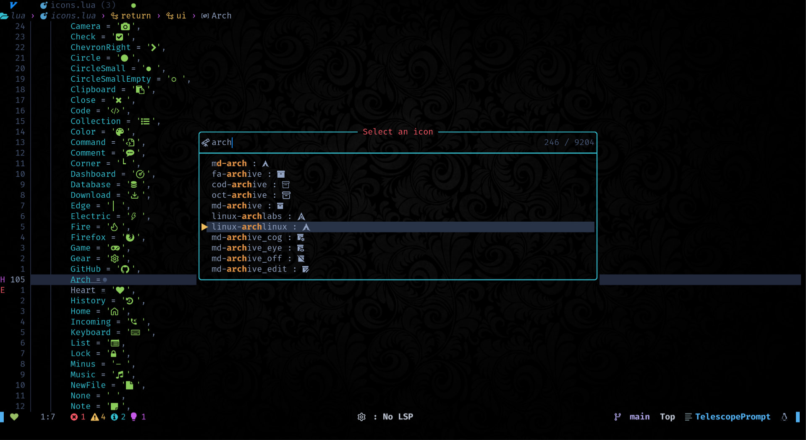

<div align = "center">

<h1><a href="https://github.com/2kabhishek/nerdy.nvim">nerdy.nvim</a></h1>

<a href="https://github.com/2KAbhishek/nerdy.nvim/blob/main/LICENSE">
 </a>

<a href="https://github.com/2KAbhishek/nerdy.nvim/graphs/contributors">
 </a>

<a href="https://github.com/2KAbhishek/nerdy.nvim/stargazers">
</a>

<a href="https://github.com/2KAbhishek/nerdy.nvim/network/members">
 </a>

<a href="https://github.com/2KAbhishek/nerdy.nvim/watchers">
 </a>

<a href="https://github.com/2KAbhishek/nerdy.nvim/pulse">
 </a>

<h3>Find Nerd Glyphs Easily 🤓🔭</h3>

<figure>
  
  <br/>
  <figcaption>nerdy.nvim in action</figcaption>
</figure>

</div>

Do you like [Nerd fonts](https://github.com/ryanoasis/nerd-fonts) too? but don't like going over to [their site](https://www.nerdfonts.com/cheat-sheet) just to fetch a glyph for your pretty terminal?

Well, me too!

Introducing nerdy.nvim, a super handy plugin that lets you easily search, preview and insert all nerd font glyphs straight from neovim!

## ✨ Features

- Fuzzy search nerd glyphs
- Preview glyphs before inserting
- Super lightweight
- Can auto generate new icons from source

## Setup

### ⚡ Requirements

- You have installed the latest version of `neovim`
- [dressing.nvim](https://github.com/stevearc/dressing.nvim) — for prettier select UI
- [telescope](https://github.com/nvim-telescope/telescope.nvim) — for fuzzy searching in list

### 🚀 Installation

```lua
-- Lazy
{
    '2kabhishek/nerdy.nvim',
    dependencies = { 'stevearc/dressing.nvim' },
    cmd = 'Nerdu',
},

-- Packer
use '2kabhishek/co-author.nvim'

```

### 💻 Usage

`nerdy.nvim` adds a new command `Nerdy`.

You can add your custom bindings for the command, the recommended keybinding is `<leader>f,`.

check `:help nerdy` for more details.

> NOTE: By default there are no configured keybindings.

#### Fetch new icons

Running the `python scripts/generator.py` command will automatically fetch new icons from [source](https://raw.githubusercontent.com/ryanoasis/nerd-fonts/master/glyphnames.json) and update the icons.

##  Behind The Code

### 🌈 Inspiration

I love nerd font glyphs, and I use them anywhere I can! but I was wasting a lot of time going back and forth between nerd font site and neovim, also the copy feature was super buggy for me on the site, so I made nerdy!

### 💡 Challenges/Learnings

- Making the generated icon table with vim.ui.select was a bit tricky.

### 🧰 Tooling

- [dots2k](https://github.com/2kabhishek/dots2k) — Dev Environment
- [nvim2k](https://github.com/2kabhishek/nvim2k) — Personalized Editor

### 🔍 More Info

- [nerdicons.nvim](https://github.com/nvimdev/nerdicons.nvim) — Nerdy was inspired by nerdicons, thanks to the original authors for the groundwork.
- [co-author.nvim](https://github.com/2kabhishek/co-author.nvim) — Another one of my plugin that easily lets you add co authors

<hr>

<div align="center">

<strong>⭐ hit the star button if you found this useful ⭐</strong><br>

<a href="https://github.com/2KAbhishek/nerdy.nvim">Source</a>
| <a href="https://2kabhishek.github.io/blog" target="_blank">Blog </a>
| <a href="https://twitter.com/2kabhishek" target="_blank">Twitter </a>
| <a href="https://linkedin.com/in/2kabhishek" target="_blank">LinkedIn </a>
| <a href="https://2kabhishek.github.io/links" target="_blank">More Links </a>
| <a href="https://2kabhishek.github.io/projects" target="_blank">Other Projects </a>

</div>

